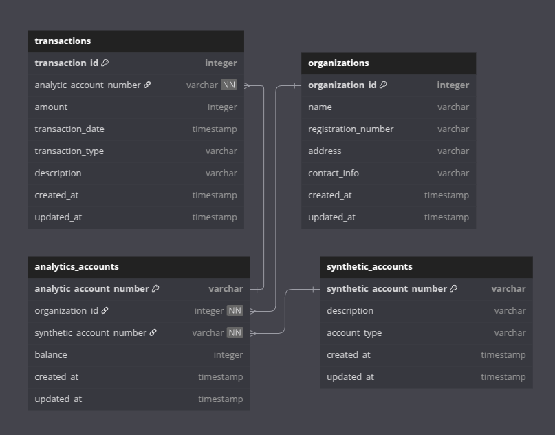

# Задача
Реализовать локальное хранилище для информации по аналитическим и балансовым счетам. 
Информация по счетам обновляется 4 раза в день, забирается из накопленного источника (внешняя 
БД).  
Фактические данные – проводки по счетам.  
Форматы данных: табличные.  

# Выбор типа хранилища данных
Для данной задачи подойдет классический Data Warehouse:
- dwh идеально подходит для отчетности (проводки по счетам);
- данные в структурированном формате в виде таблиц;
- загрузка 4 раза в день;  

Слои данных:
- Staging - для первичной загрузки данных из накопленного источника, "как есть";
- Storage - для хранения и обработанных данных в более структурированном виде;
- Presentation - для построения бизнес-витрин;

Данные слои позволят разделить загрузку данных, обработку и представление в виде витрин. 
Каждый слой имеет свою цель, что позволяет оптимизировать каждый этап. 
В случаем необходимости, можно будет масштабировать, что при меньшем количестве слоев было бы сложнее.

# Модель данных
Найдите и изучите таблицы из t1_dwh_potok3_accounts. Реализуйте на базе таблиц модель данных 
ядра хранилища в 3НФ (Inmon) или же в 1-2НФ (Kimball) в формате ER-диаграммы. Используйте 
рекомендации из лекционного материала.
Формат ответа: Текстовый документ.

t1_dwh_potok3_accounts:  
  

Модель данных ядра хранилища (3НФ, Inmon):  
- Связи логические, т.к. физические ограничат скорость в рамках GreenPlum;
- в core слой будет добавлен справочник transaction_type;
  

